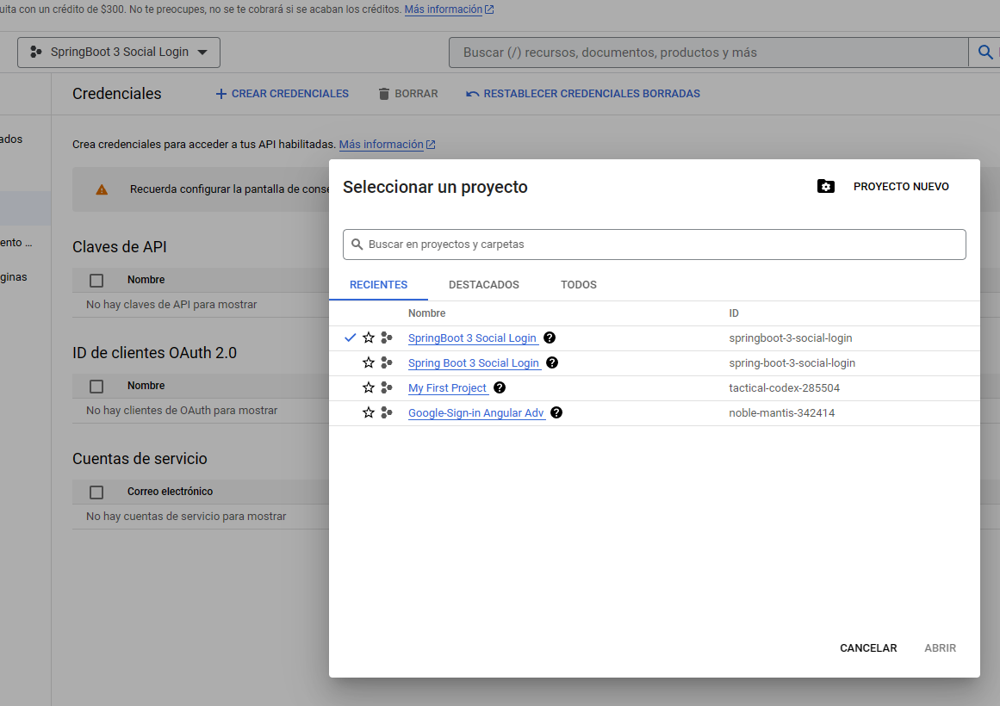
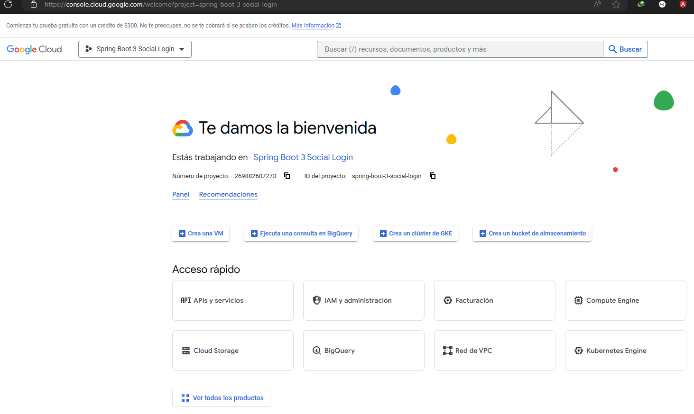
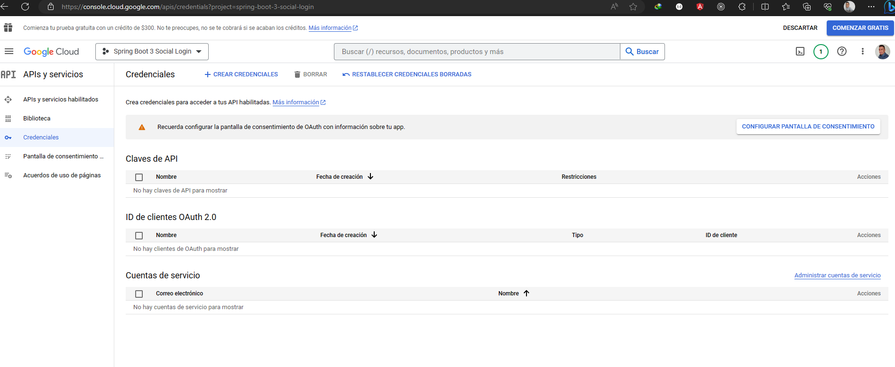
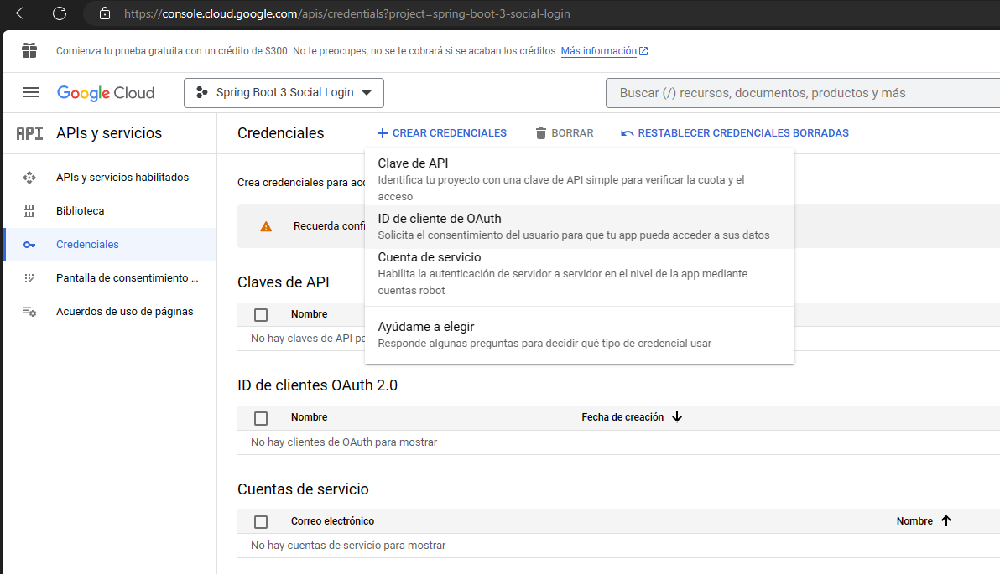
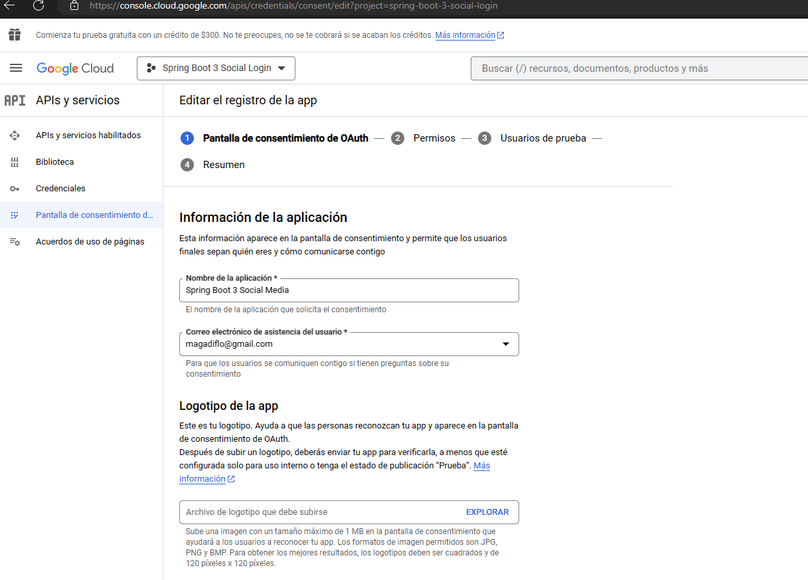
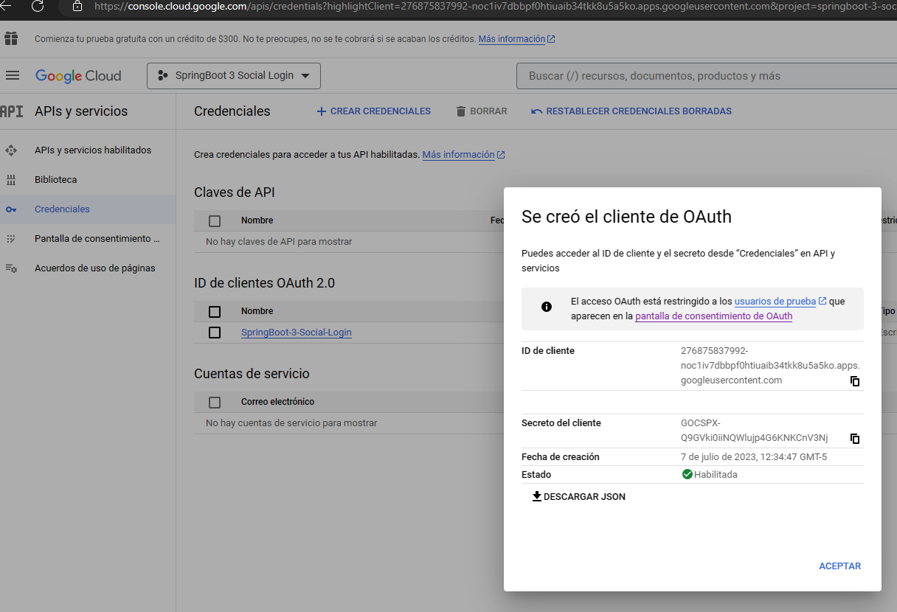
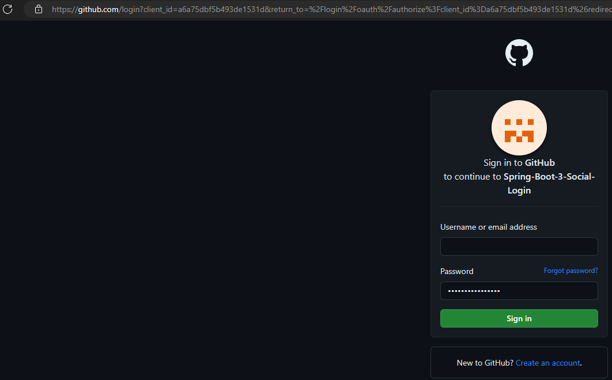
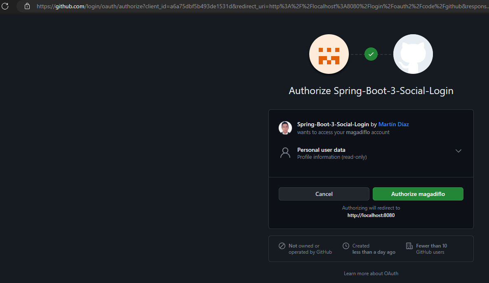
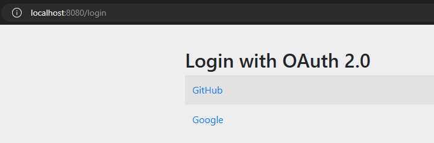
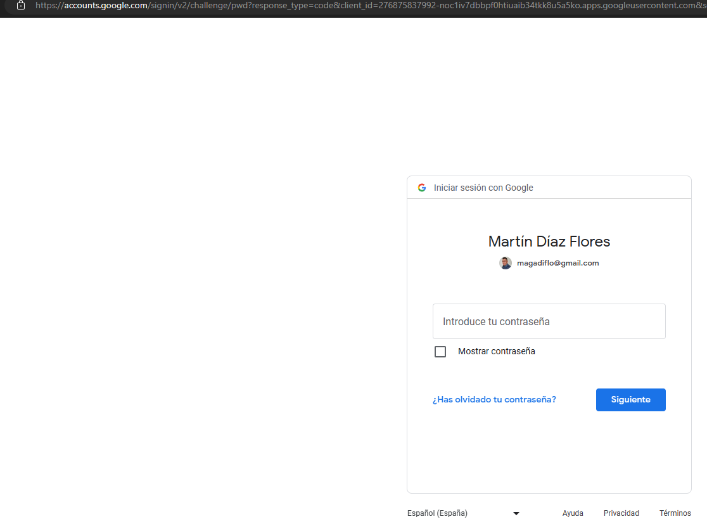

# [OAuth2 & Spring boot 3 & Social login | never been easier](https://www.youtube.com/watch?v=2WNjmT2z7c4&t=2244s)

Youtube: Tutorial tomado del canal de **Bouali Ali**.  

Referencia: [**Spring Security In Action 2020**](https://github.com/magadiflo/spring-security-in-action-2020/blob/main/12.how_does_oauth-2_work.md)

---

## Gestión de servidor de autorizaciones

No implementaremos nuestro propio servidor de autorización, sino que usaremos algunos ya existentes:
**GitHub y Google.** En ese sentido, configuraremos nuestro cliente dentro de los servidores de autorización. Para ser
más exactos, generaremos las credenciales para el cliente. Un cliente usa estas credenciales para autenticarse en el
servidor de autorización, por lo que la aplicación OAuth debe registrarse con el servidor de autorización, en nuestro
caso, como usaremos a GitHub y Google como nuestros servidores de autorización, nos debemos registrar en ambos.

## Generando credenciales para el cliente en GitHub

````
Acceso Rápido: https://github.com/settings/applications/new
Cómo se llega a la url de arriba: Foto de perfil / Settings / Developer Settings / OAuth Apps / New OAuth App

````

Una vez lleguemos al formulario, debemos llenar como mínimo 3 campos:

- **Homepage URL**, es nuestra página de inicio.
- **Authorization callback URL**, significa que en primer lugar, esta es la URL completa para redirigir al usuario, así
  que una vez que el usuario acepta ser autorizado necesitamos enviarlo de vuelta a la URL de devolución de llamada.
  Después de un inicio de sesión exitoso, queremos volver a la misma url de la que vinimos.


Luego de darle en el botón **Register application** nos muestra la interfaz con las credenciales y algunos datos
adicionales.


Como observamos nos generará:

- **Client ID:** a6a75dbf5b493de1531d
- **Client secret:** 2c24932455932162e0ac4dcccfce262c83f4de59

**NOTA**
> Para crear el Client secret debemos darle en **Generate a new client secret**
> Al finalizar este tutorial, eliminaré el **client secret**

## Generando credenciales para el cliente en Google

Con nuestra **cuenta de google iniciada**, acceder a la siguiente url:

````
https://console.cloud.google.com
````

- En el dashboard mostrado click en el select: Google-Sign-In...
- Se abrirá un modal con todos los proyectos que tenga.
- Clic en Proyecto Nuevo, nos llevará al siguiente formulario donde **solo colocamos el nombre del proyecto**:
  SpringBoot 3 Social Login.
- Luego de haber creado el proyecto, clicamos en el select: Google-Sign-In... nos abrirá el modal del principio y
  seleccionamos nuestro proyecto recién creado.
  

- Nos mostrará el dashboard de nuestro proyecto creado, observar que tiene mucha información de la cual, lo único que
  nos interesa es crear credenciales para nuestro cliente que usará a google como servidor de autorización. Entonces
  ahora, **damos clic en API APIs y servicios**:
  

- Damos clic en **Credenciales**:
  

- Crear credenciales para **ID de cliente de OAuth**:
  

- Luego clic en el botón: **Configurar pantalla de consentimiento**
  En la siguiente pantalla estará nos mostrará [] Internos y [] Externos, solo damos en el botón **Crear**.
  Ingresamos los campos básicos: nombre de la aplicación, etc., luego continuamos con la pantalla de Permisos, Usuarios
  de prueba y Resumen, en dichas pantallas solo di en siguiente o continuar:
  

- Luego, click en credenciales, y volvemos a dar en **Crear credenciales**, **ID de cliente de OAuth**.
  

- Credenciales del cliente OAuth de google
  

````
client-id: 276875837992-noc1iv7dbbpf0htiuaib34tkk8u5a5ko.apps.googleusercontent.com
Client-secret: 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
````

## Creando nuestro endpoint seguro

Si recordamos, nuestro proyecto de Spring Boot tiene las siguientes dependencias:

````xml

<dependencies>
    <dependency>
        <groupId>org.springframework.boot</groupId>
        <artifactId>spring-boot-starter-oauth2-client</artifactId>
    </dependency>
    <dependency>
        <groupId>org.springframework.boot</groupId>
        <artifactId>spring-boot-starter-web</artifactId>
    </dependency>

    <dependency>
        <groupId>org.projectlombok</groupId>
        <artifactId>lombok</artifactId>
        <optional>true</optional>
    </dependency>
    <dependency>
        <groupId>org.springframework.boot</groupId>
        <artifactId>spring-boot-starter-test</artifactId>
        <scope>test</scope>
    </dependency>
</dependencies>
````

Ahora crearemos un endpoint que estará **automáticamente asegurada** al haber agregado la dependencia de
**spring-boot-starter-oauth2-client** ya que este incluye parte de las dependencias de Spring Security.

````java

@RestController
@RequestMapping(path = "/api/v1/demo")
public class DemoController {
    @GetMapping
    public ResponseEntity<String> hello() {
        return ResponseEntity.ok("Hello from secured endpoint!");
    }
}
````

Al ejecutar el proyecto, veremos en consola una contraseña random:

````
Using generated security password: 6359432d-3b30-40ca-a21b-c724a3a9ef90
````

Accedemos a la url de nuestro proyecto e ingresamos las credenciales: **user** y el pass generado aleatoriamente. Este
flujo es similar a cuando agregábamos **Spring Security** a nuestro proyecto, automáticamente los aseguraba.

## Configuraciones de seguridad

Establezcamos las configuraciones de seguridad para permitir que nuestra aplicación use el inicio de sesión ya sea con
GitHub o Google. Empezamos escribiendo una clase de configuración, creamos el método SecurityFilterChain que recibe
como parámetro el HttpSecurity http. Y ahora una diferencia: en lugar de usar httpBasic() o formLogin(), llamamos a un
método diferente llamado **oauth2Login(Customizer.withDefaults())**. Pero sabes lo que está pasando. Al igual que con
httpBasic() o formLogin(), oauth2Login() simplemente agrega un nuevo filtro de autenticación a la cadena de filtros Este
código se presenta en el siguiente listado:

````java

@EnableWebSecurity(debug = true)
@Configuration
public class SecurityConfig {
    public SecurityFilterChain securityFilterChain(HttpSecurity http) throws Exception {
        http
                .csrf(AbstractHttpConfigurer::disable)
                .authorizeHttpRequests(authorize -> {
                    authorize.anyRequest().authenticated();
                })
                .oauth2Login(Customizer.withDefaults());

        return http.build();
    }
}
````

## Agregando las configuraciones de OAuth2 GitHub (Implementando el ClientRegistration)

**NOTA**

> Necesitamos establecer en esta sección que GitHub será nuestro servidor de autorización. Para ello, Spring Security
> define el contrato ClientRegistration. La interfaz ClientRegistration representa al cliente en la arquitectura OAuth2.
> Entonces para representar el cliente OAuth 2 para Spring Security usamos la implementación del contrato
> ClientRegistration. Pero también debemos configurarlo para usarlo para la autenticación. Para ello, Spring Security
> utiliza un objeto de tipo ClientRegistrationRepository quien encuentra un ClientRegistration por su ID de registro.
>
> Esta forma de configurar la estoy sacando del libro de
> [Spring Security In Action 2020](https://github.com/magadiflo/spring-security-in-action-2020/blob/main/12.how_does_oauth-2_work.md),
> pero esta forma de configurar es de manera programática, en el libro se menciona, además de este, un tercer enfoque,
> el cual es usar el archivo de propiedades y establecer allí las configuraciones. En este tutorial se hace lo mismo,
> solo quise dejar esta nota para hacer saber que existen otras formas de configurar.

Con este tercer enfoque no necesitamos especificar en el archivo de configuración ningún detalle sobre
ClientRegistration y ClientRegistrationRepository porque Spring Boot los crea automáticamente en función del archivo de
propiedades.

````properties
# GitHub
spring.security.oauth2.client.registration.github.client-id=a6a75dbf5b493de1531d
spring.security.oauth2.client.registration.github.client-secret=2c24932455932162e0ac4dcccfce262c83f4de59
````

Solo basta con agregar las dos configuraciones anteriores para que ya tengamos configurado nuestro cliente de GitHub,
ahora si ejecutamos el proyecto **ya no veremos el password generado aleatoriamente**, eso significa que hasta ahora
va todo bien.

## Probando el flujo de Authorization

- Lo primero que haré será cerrar sesión de mi cuenta de GitHub para ver cuál sería su flujo.
- Accedemos a nuestro endpoint seguro ``http://localhost:8080/api/v1/demo``
- Veremos que nos redirecciona automáticamente a la siguiente pantalla para autenticarnos con nuestras credenciales de
  GitHub
  

- Luego nos muestra esta otra pantalla para autorizar al cliente **Spring-Boot-3-Social-Login** se pueda acceder con la
  cuenta de magadiflo.
  

- Finalmente dando click en **Authorize magadiflo** veremos que somos redireccionados a nuestro endpoint solicitado
  inicialmente.

## Agregar Google como proveedor de OAuth 2.0

Al igual que hicimos con GitHub, configuraremos esta vez para Google:

````properties
# Google
spring.security.oauth2.client.registration.google.client-id=276875837992-noc1iv7dbbpf0htiuaib34tkk8u5a5ko.apps.googleusercontent.com
spring.security.oauth2.client.registration.google.client-secret=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
````

- Ahora, reiniciemos la aplicación y accedamos a nuestro endpoint asegurado: ``http://localhost:8080/api/v1/demo``.
- Como ahora tenemos dos proveedores de Servidor de Authorization, al ingresar al endpoint asegurado, nos mostrará
  la página ``http://localhost:8080/login`` con el enlace hacia los dos servidores de authorization:
  

- Ahora, al dar click en **Google**, nos redigire al formulario para iniciar sesión:
  
- Luego de ingresar las credenciales y dar en **Siguiente** automáticamente nos redirige a nuestro endpoint asegurado.