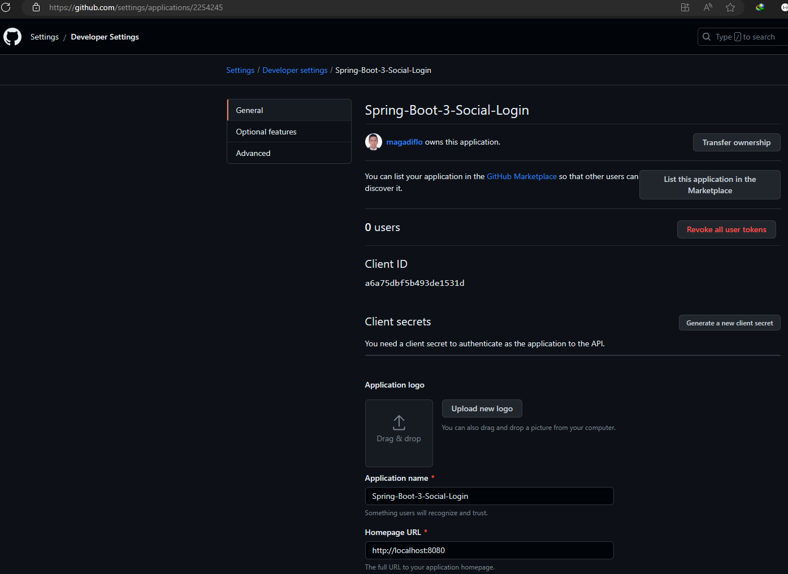

# [OAuth2 & Spring boot 3 & Social login | never been easier](https://www.youtube.com/watch?v=2WNjmT2z7c4&t=2244s)

Tutorial tomado del canal de **Bouali Ali** en youtube.

---

## Gestión de servidor de autorizaciones

No implementaremos nuestro propio servidor de autorización, sino que usaremos algunos ya existentes:
**GitHub y Google.** En ese sentido, configuraremos nuestro cliente dentro de los servidores de autorización. Para ser
más exactos, generaremos las credenciales para el cliente. Un cliente usa estas credenciales para autenticarse en el
servidor de autorización, por lo que la aplicación OAuth debe registrarse con el servidor de autorización, en nuestro
caso, como usaremos a GitHub y Google como nuestros servidores de autorización, nos debemos registrar en ambos.

## Generando credenciales para el cliente en GitHub

````
Acceso Rápido: https://github.com/settings/applications/new
Cómo se llega a la url de arriba: Foto de perfil / Settings / Developer Settings / OAuth Apps / New OAuth App

````

Una vez lleguemos al formulario, debemos llenar como mínimo 3 campos:

- **Homepage URL**, es nuestra página de inicio.
- **Authorization callback URL**, significa que en primer lugar, esta es la URL completa para redirigir al usuario, así
  que una vez que el usuario acepta ser autorizado necesitamos enviarlo de vuelta a la URL de devolución de llamada.
  Después de un inicio de sesión exitoso, queremos volver a la misma url de la que vinimos.


Luego de darle en el botón **Register application** nos muestra la interfaz con las credenciales y algunos datos
adicionales.



Como observamos nos generará:

- **Client ID:** a6a75dbf5b493de1531d
- **Client secret:** 2c24932455932162e0ac4dcccfce262c83f4de59

**NOTA**
> Para crear el Client secret debemos darle en **Generate a new client secret**
> Al finalizar este tutorial, eliminaré el **client secret**

