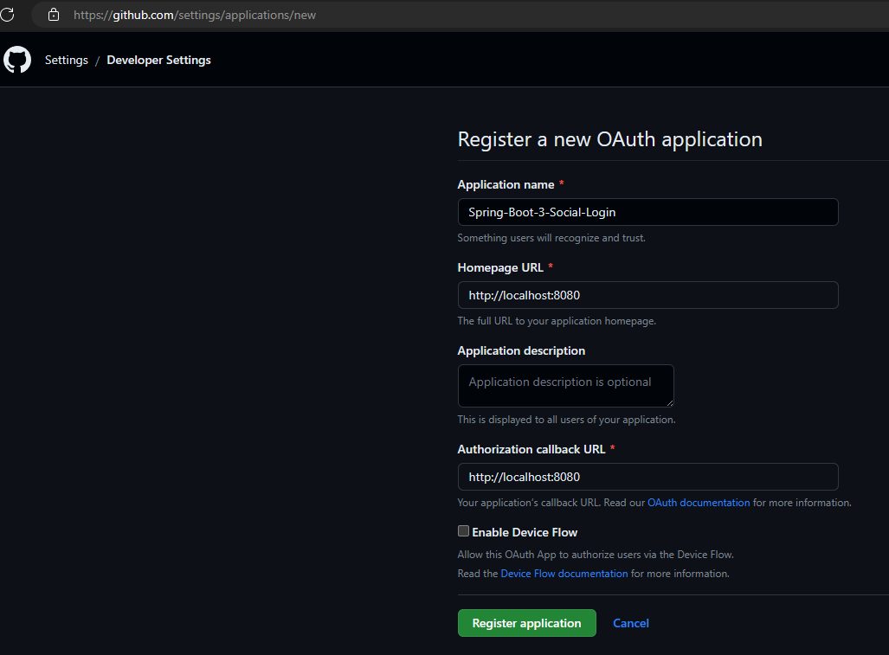

# [OAuth2 & Spring boot 3 & Social login | never been easier](https://www.youtube.com/watch?v=2WNjmT2z7c4&t=2244s)

Tutorial tomado del canal de **Bouali Ali** en youtube.

---

## Gestión de servidor de autorizaciones

No implementaremos nuestro propio servidor de autorización, sino que usaremos algunos ya existentes:
**GitHub y Google.** En ese sentido, configuraremos nuestro cliente dentro de los servidores de autorización. Para ser
más exactos, generaremos las credenciales para el cliente. Un cliente usa estas credenciales para autenticarse en el
servidor de autorización, por lo que la aplicación OAuth debe registrarse con el servidor de autorización, en nuestro
caso, como usaremos a GitHub y Google como nuestros servidores de autorización, nos debemos registrar en ambos.

## Generando credenciales para el cliente en GitHub

````
Acceso Rápido: https://github.com/settings/applications/new
Cómo se llega a la url de arriba: Foto de perfil / Settings / Developer Settings / OAuth Apps / New OAuth App

````

Una vez lleguemos al formulario, debemos llenar como mínimo 3 campos:

- **Homepage URL**, es nuestra página de inicio.
- **Authorization callback URL**, significa que en primer lugar, esta es la URL completa para redirigir al usuario, así
  que una vez que el usuario acepta ser autorizado necesitamos enviarlo de vuelta a la URL de devolución de llamada.
  Después de un inicio de sesión exitoso, queremos volver a la misma url de la que vinimos.



Luego de darle en el botón **Register application** nos muestra la interfaz con las credenciales y algunos datos
adicionales.


Como observamos nos generará:

- **Client ID:** a6a75dbf5b493de1531d
- **Client secret:** 2c24932455932162e0ac4dcccfce262c83f4de59

**NOTA**
> Para crear el Client secret debemos darle en **Generate a new client secret**
> Al finalizar este tutorial, eliminaré el **client secret**

## Generando credenciales para el cliente en Google

Con nuestra **cuenta de google iniciada**, acceder a la siguiente url:

````
https://console.cloud.google.com
````

- En el dashboard mostrado click en el select: Google-Sign-In...
- Se abrirá un modal con todos los proyectos que tenga.
- Clic en Proyecto Nuevo, nos llevará al siguiente formulario donde **solo colocamos el nombre del proyecto**:
  SpringBoot 3 Social Login.
- Luego de haber creado el proyecto, clicamos en el select: Google-Sign-In... nos abrirá el modal del principio y
  seleccionamos nuestro proyecto recién creado.
  

- Nos mostrará el dashboard de nuestro proyecto creado, observar que tiene mucha información de la cual, lo único que
  nos interesa es crear credenciales para nuestro cliente que usará a google como servidor de autorización. Entonces
  ahora, **damos clic en API APIs y servicios**:
  

- Damos clic en **Credenciales**:
  

- Crear credenciales para **ID de cliente de OAuth**:
  

- Luego clic en el botón: **Configurar pantalla de consentimiento**
  En la siguiente pantalla estará nos mostrará [] Internos y [] Externos, solo damos en el botón **Crear**.
  Ingresamos los campos básicos: nombre de la aplicación, etc., luego continuamos con la pantalla de Permisos, Usuarios
  de prueba y Resumen, en dichas pantallas solo di en siguiente o continuar:
  

- Luego, click en credenciales, y volvemos a dar en **Crear credenciales**, **ID de cliente de OAuth**.
  

- Credenciales del cliente OAuth de google
  

````
client-id: 276875837992-noc1iv7dbbpf0htiuaib34tkk8u5a5ko.apps.googleusercontent.com
Client-secret: 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
````

## Creando nuestro endpoint seguro

Si recordamos, nuestro proyecto de Spring Boot tiene las siguientes dependencias:

````xml

<dependencies>
    <dependency>
        <groupId>org.springframework.boot</groupId>
        <artifactId>spring-boot-starter-oauth2-client</artifactId>
    </dependency>
    <dependency>
        <groupId>org.springframework.boot</groupId>
        <artifactId>spring-boot-starter-web</artifactId>
    </dependency>

    <dependency>
        <groupId>org.projectlombok</groupId>
        <artifactId>lombok</artifactId>
        <optional>true</optional>
    </dependency>
    <dependency>
        <groupId>org.springframework.boot</groupId>
        <artifactId>spring-boot-starter-test</artifactId>
        <scope>test</scope>
    </dependency>
</dependencies>
````

Ahora crearemos un endpoint que estará **automáticamente asegurada** al haber agregado la dependencia de
**spring-boot-starter-oauth2-client** ya que este incluye parte de las dependencias de Spring Security.

````java

@RestController
@RequestMapping(path = "/api/v1/demo")
public class DemoController {
    @GetMapping
    public ResponseEntity<String> hello() {
        return ResponseEntity.ok("Hello from secured endpoint!");
    }
}
````

Al ejecutar el proyecto, veremos en consola una contraseña random:

````
Using generated security password: 6359432d-3b30-40ca-a21b-c724a3a9ef90
````

Accedemos a la url de nuestro proyecto e ingresamos las credenciales: **user** y el pass generado aleatoriamente. Este
flujo es similar a cuando agregábamos **Spring Security** a nuestro proyecto, automáticamente los aseguraba.

